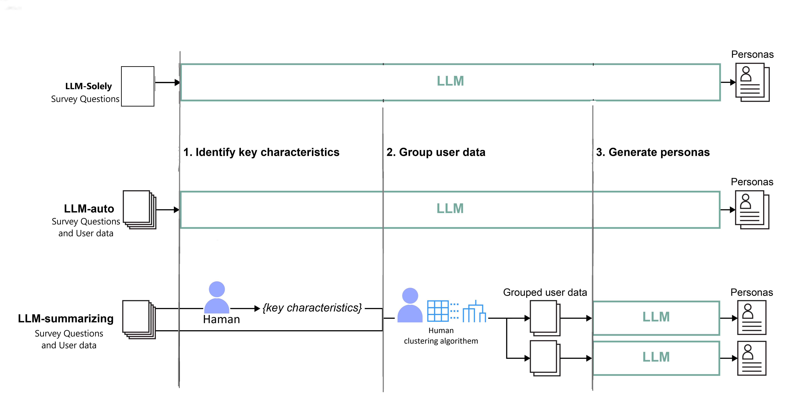
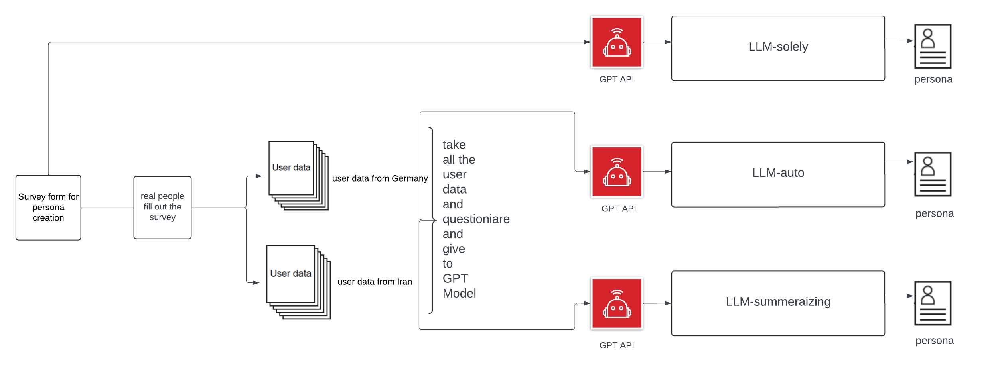

# Understanding Human–AI Workflows for Generating Personas



Picture is modified from papare "Understanding Human-AI Workflows for Generating Personas doi: 10.1145/3643834.3660729."

<ul style="margin-bottom: 20px;">
  <li style="margin-bottom: 10px;">This project shows that LLMs can help generate representative personas from user data, in a human-AI workflow.</li>
  <li style="margin-bottom: 10px;">with this project you can try 3 different persona-generation workflows.</li>
  <ul>
    <li style="margin-bottom: 10px;"><i>LLM-solely</i>: Relies on LLM's knowledge for answering the survey and generating persona.</li>
    <li style="margin-bottom: 10px;"><i>LLM-auto</i>: Model get all the user data and then create persona and answer survey based on that.</li>
    <li style="margin-bottom: 10px;"><i>LLM-summarizing</i>: Human cluster the user data based on similar traits and model get the clustered user data and and just create persona for each cluster and answer the survey.</li> 
  </ul>
</ul>

<br>

## Setup

Create the environment **inside this directory** (it is optional to create a virtual environment but I would suggest to create).

```sh
python -m venv .venv
```

activate it like so:

```sh
& .\.venv\Scripts\activate
```

or like this on Linux/Max:

```sh
. ./.venv/bin/activate
```
You need OpenAI API key to try out our workflow. Follow [Developer quickstart](https://platform.openai.com/docs/quickstart) from OpenAI.

1. Download the repository.
2. Install libraries.
```
pip install matplotlib numpy openai pandas scikit_learn scipy
```
3. Open [settings.py](./settings.py) to input your OpenAI API key and set the models available to you. For example...
```
openai_api_key = "your-OpenAI-API-Key"
gpt_model = "gpt-4"
embedding_model = "text-embedding-ada-002"
```
4. All set. Follow the usage below to try our workflows.

<br>

## Usage
I provide survey questions [survey-questiond](./data/Survey-questions.txt) for all the approaches
then for LLM_auto I provided [Germans and Iranians user data](./data) people's response to the survey questions, 30 people for each country seperatly, this data is used inthe LLM_auto approch.
the same user data but clustered exist in [Clustered Germans and Iranians user data](./llm_summarizing/exploration) which is used in the LLM_simmarizing approach.
```
survey file_name = "Survey-questions.txt"
user data for LLM_auto file_name = "Germany-results-survey721739.csv" & "Iran-results-survey721739.csv"
user data for LLM-summarizing file_name = "grouped-Germany-results-survey721739.csv" & "grouped-Iran-results-survey721739.csv"

```
Example input and resulting personas in each [llm_solely](./llm_solely), [llm_auto](./llm_auto), [llm_summarizing](./llm_summarizing), folder.

If you wish to use your own user data, put it in the [data](./data) or [text](llm_summarizing/exploration) folder, change the filenames accordingly to your data .

<br>

### LLM-Solely
You do not need to make any further changes. 
1. Run [llm_solely.py](./llm_solely.py).
2. Personas are stored in the [llm_solely][def] folder.

<br>

### LLM-auto
You do not need to make any further changes. 
1. Run [llm_auto.py](./llm_auto.py).
2. Personas are stored in the [llm_auto](./llm_auto) folder.

<br>

### LLM-summarizing 
You do not need to make any further changes. 
1. Run [llm_summarizing.py](./llm_summarizing.py).
* the user data that is used here is the clustered user data 
2. Personas are stored in the [llm_summarizing](./llm_summarizing) folder.

### user persona generation across cultures 


